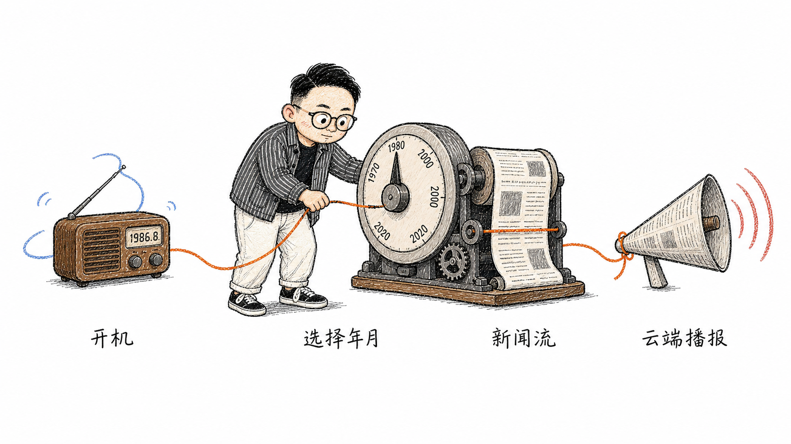

# 📻 AI时光收音机

> **你想听听，你出生的那一年、那一个月，世界正在发生什么吗？**

也许那时的街口还停着二八自行车，窗台上晾着刚刚翻过的旧报纸；  
也许某一条新闻，曾被你的父母在晚饭后听见，却从未被你亲耳听过。

**AI时光收音机**想做的，就是把那些已经远去的年月，重新调回你的耳边。

按下电源，白噪声从老式木壳收音机里缓缓响起；转动年份与月份旋钮，再按下播放键。DeepSeek 会流式整理那个月的重要历史新闻，讯飞或百度云端语音则会把文字变成声音。新闻不必全部生成完才开始播报——每一条抵达后，都会进入播放队列。

**作品名称：** AI时光收音机  
**作品作者：** AI | 造物主 | 三川


## 它能做什么

- 旋转两个复古旋钮，选择年份与月份。
- 开机后点亮日期显示屏，并循环播放内置环境白噪声。
- 开机后调整年月，停止操作 2 秒会自动重新抓取该时间的新闻；也可点击播放立即开始。
- 新闻逐条返回、逐条显示，不必等待整期内容生成完毕。
- 可选择讯飞在线语音合成或百度短文本语音合成进行播报。
- 支持播放与暂停，并可独立调节播报音量和白噪声音量。
- 支持保存、清空 DeepSeek 与 TTS 配置，以及刷新模型和声音列表。
- 前端与 FastAPI 后端同源部署，可在本机运行，也可部署到服务器。

## 项目流程



从开机、选择年月，到 DeepSeek 流式整理新闻，再到云端 TTS 播报；每一条新闻都会沿着时间线抵达你的耳边。

## 一次时光旅行

1. 点击**开机按钮**，让收音机亮起来。
2. 转动**年份旋钮**与**月份旋钮**，找到想回去的时间。
3. 停止调整 2 秒后，系统会自动请求并接收历史新闻；也可点击**播放按钮**立即开始。
4. 如果已经配置 TTS，第一条新闻准备好后便会开始播报。
5. 点击**播放 / 暂停按钮**，随时停在这一刻，或继续听下去。

> 开机后调整年月，系统会等待 2 秒防抖；如果期间继续转动旋钮，计时会重新开始。停止操作后才会请求 DeepSeek，避免旋钮转动时反复产生 API 调用。

## 快速开始

### 环境要求

- Windows 10/11 或 macOS
- Python 3.11 或 3.12
- 可访问 DeepSeek、讯飞或百度云服务的网络
- 一个 DeepSeek API Key
- 讯飞 TTS 或百度 TTS 凭证，二选一即可

### 环境与依赖清单

项目是纯 Python Web 应用，不需要 Node.js、npm、CUDA、Qwen 本地模型或 Whisper 本地模型。浏览器负责界面和音频播放，FastAPI 负责新闻与云端 TTS 的请求转发。

运行环境与依赖由 `pyproject.toml` 统一声明：

| 类型 | 名称 | 作用 |
| --- | --- | --- |
| 运行时 | Python 3.11 或 3.12 | 启动后端服务 |
| Web 框架 | FastAPI | 提供页面和 API |
| HTTP 客户端 | HTTPX | 请求 DeepSeek、百度接口 |
| 数据校验 | Pydantic | 校验请求和流式响应 |
| ASGI 服务 | Uvicorn（standard） | 运行 FastAPI |
| WebSocket | websockets | 连接讯飞流式 TTS |
| 构建工具 | Hatchling | 安装项目本身时自动使用 |

测试依赖（`pytest`）只在开发测试时需要，不会由运行依赖安装脚本安装。

#### Windows 一键安装依赖

首次使用推荐按下面的顺序操作：

1. 双击项目根目录的 `安装时光收音机依赖.bat`。
2. 等待脚本创建 `.venv-web` 并完成依赖导入检查。
3. 再双击 `启动时光收音机.bat` 启动服务。

安装脚本优先使用 `uv`；没有 `uv` 时使用 Python Launcher（`py`）或 `python`。它只安装运行依赖，不安装 `pytest`，也不会启动后端；脚本可以重复执行，用于补齐或更新依赖。需要联网下载 Python 包。

如果跳过安装脚本，`启动时光收音机.bat` 也会在发现 `.venv-web` 不存在或尚未安装时自动创建环境并安装依赖。

### Windows

依赖安装完成后，直接双击：

```text
启动时光收音机.bat
```

浏览器访问：

```text
http://127.0.0.1:8766
```

启动脚本使用项目专用的 `.venv-web` 虚拟环境，并安装 `pyproject.toml` 中声明的依赖。首次创建环境需要联网，时间会比之后稍长。

### macOS

首次运行前，在终端进入项目目录并赋予脚本执行权限：

```bash
chmod +x 启动时光收音机.command
```

之后双击 `启动时光收音机.command`，或在终端执行：

```bash
./启动时光收音机.command
```

脚本会优先使用 `uv` 创建环境；没有 `uv` 时会寻找 Python 3.11 或 3.12。它会检查已有 `.venv-web` 的 Python 版本，并在依赖缺失或端口启动失败时给出明确提示。默认地址为 `http://127.0.0.1:8766`。

## 准备三把“时间钥匙”

DeepSeek 负责整理新闻；讯飞和百度负责把新闻读出来。因此：

| 服务 | 用途 | 本项目需要的凭证 | 是否必需 |
| --- | --- | --- | --- |
| DeepSeek | 生成与流式返回历史新闻 | API Key | 必需 |
| 讯飞在线语音合成 | 将新闻合成为语音 | APPID、APIKey、APISecret | 与百度二选一 |
| 百度短文本语音合成 | 将新闻合成为语音 | API Key、Secret Key | 与讯飞二选一 |

### 1. 申请 DeepSeek API Key

1. 打开 [DeepSeek 开放平台](https://platform.deepseek.com/)并注册或登录账号。
2. 进入 [API Keys 页面](https://platform.deepseek.com/api_keys)。
3. 创建一枚新的 API Key，并在创建后立即复制、妥善保存。
4. 确认账户拥有可用额度；API 调用会按照 DeepSeek 当前计费规则消耗额度。
5. 回到 AI时光收音机的**播音设置 → DeepSeek 新闻**，粘贴 API Key。
6. 点击**刷新模型**，选中可用模型，再点击**选择此模型**。
7. 如需下次自动恢复，点击**保存 API Key**。

DeepSeek 官方接入文档给出的 API 地址是 `https://api.deepseek.com`，本项目会通过后端安全地向该地址发起请求。模型名称和价格可能调整，请以 [DeepSeek API 官方文档](https://api-docs.deepseek.com/)为准。

### 2. 申请讯飞在线语音合成凭证

1. 打开 [讯飞开放平台](https://www.xfyun.cn/)，注册或登录账号。
2. 进入控制台，在**我的应用**中创建新应用。
3. 为该应用添加或开通**在线语音合成**服务，并领取试用额度或购买服务量。
4. 打开 [在线语音合成控制台](https://console.xfyun.cn/services/tts)，找到当前应用。
5. 复制该应用的 **APPID、APIKey、APISecret**。
6. 在**发音人授权管理**中试用或购买需要的发音人。只有当前应用已获授权的发音人才可以正常合成。
7. 回到本项目，选择 **TTS 引擎 → 讯飞**，填入三项凭证。
8. 点击**刷新声音**并选择发音人；如果已知控制台中的发音人参数，也可填写对应的 `vcn`。
9. 点击**保存**。

讯飞在线语音合成使用 WebSocket 流式接口，官方文档明确要求从控制台取得 APPID、APIKey 和 APISecret。发音人、免费额度、并发数与有效期均以你的控制台授权为准。详细说明见 [讯飞在线语音合成 API 文档](https://www.xfyun.cn/doc/tts/online_tts/API.html)。

### 3. 申请百度语音合成凭证

1. 打开 [百度智能云](https://cloud.baidu.com/)，注册或登录账号。
2. 按平台要求完成实名认证。
3. 进入[百度智能云语音技术控制台](https://console.bce.baidu.com/ai/#/ai/speech/overview/index)。
4. 在概览页快速创建应用，或进入**应用列表 → 创建应用**。
5. 创建时勾选需要使用的语音合成服务接口。
6. 创建完成后，在应用列表中复制 **API Key** 与 **Secret Key**。
7. 回到本项目，选择 **TTS 引擎 → 百度**，填入这两项凭证。
8. 点击**刷新声音**，选择一个当前接口支持的发音人，然后点击**保存**。

百度官方说明中，API Key 与 Secret Key 是应用调用接口的凭证，泄露可能导致资源被盗用。免费测试资源、服务权限和当前额度请以控制台显示为准。完整流程见 [百度语音技术：资源领取与应用创建](https://cloud.baidu.com/doc/SPEECH/s/4l9mh6qf9)，接口限制见 [百度短文本在线合成文档](https://ai.baidu.com/ai-doc/SPEECH/mlbxh7xie)。

## 配置与隐私

- DeepSeek、讯飞和百度的凭证，只有在你主动点击**保存**后，才会写入当前浏览器的 `localStorage`。
- 点击对应的**清空**按钮，会删除当前浏览器保存的配置，并清空输入框。
- FastAPI 服务不会把这些凭证写入服务端数据库或配置文件，但请求时仍需由后端转发给相应云服务。
- 不要把真实密钥写进代码、截图、公开仓库或聊天记录。
- 不要在公共电脑或不可信浏览器中保存密钥。
- 部署到公网时必须启用 HTTPS，并限制站点访问权限；浏览器本地保存不等于服务端密钥托管方案。
- 如果密钥曾经公开，请立即前往对应平台删除或重新生成，不要只在本项目中点击清空。

## 服务器部署

### Docker

```bash
docker build -t time-radio .
docker run --rm -p 8766:8766 time-radio
```

访问 `http://服务器地址:8766`。正式环境建议在容器前配置 Nginx、Caddy 或云厂商 HTTPS 网关，不要直接把开发端口暴露到公网。

### Python

```bash
python -m venv .venv-web
```

Windows：

```powershell
.\.venv-web\Scripts\python.exe -m pip install --upgrade pip
.\.venv-web\Scripts\python.exe -m pip install .
.\.venv-web\Scripts\python.exe -m uvicorn time_radio.main:app --host 0.0.0.0 --port 8766 --proxy-headers
```

macOS / Linux：

```bash
./.venv-web/bin/python -m pip install .
./.venv-web/bin/python -m uvicorn time_radio.main:app --host 0.0.0.0 --port 8766 --proxy-headers
```

## 项目结构

```text
Time Radio/
├─ tests/                               # 集成与行为测试
├─ assets/
│  └─ time-radio-illustrations/          # 项目流程插图
├─ time_radio/
│  ├─ providers/                        # DeepSeek、讯飞、百度连接器
│  ├─ static/
│  │  ├─ assets/                        # 收音机背景图与白噪声音频
│  │  ├─ app.js                         # 页面交互、流式新闻与播放队列
│  │  ├─ index.html                     # Web UI
│  │  └─ styles.css                     # 复古视觉样式
│  ├─ main.py                           # FastAPI 路由与静态站点
│  ├─ models.py                         # 请求与响应数据模型
│  └─ services.py                       # TTS 服务编排
├─ Dockerfile
├─ pyproject.toml
├─ 安装时光收音机依赖.bat
├─ 启动时光收音机.bat
└─ 启动时光收音机.command
```

## 使用说明与边界

- 本项目中的历史新闻由 DeepSeek 基于模型知识整理，**不是实时联网搜索或史料数据库检索**。
- AI 生成的日期、人物、事件与表述可能存在遗漏或偏差，重要内容请以权威史料为准。
- 选定的年月越久远、史料越稀少，模型能够提供的精确月度信息可能越有限。
- TTS 未配置、额度不足或合成失败时，新闻仍会继续返回并显示，只是不会产生语音。
- 云服务的免费额度、价格、模型、发音人和授权规则可能变化，请始终以各平台控制台与最新官方文档为准。

## 开发与测试

安装测试依赖：

```powershell
.\.venv-web\Scripts\python.exe -m pip install -e ".[test]"
```

运行测试：

```powershell
.\.venv-web\Scripts\python.exe -m pytest -q
```

---

有些年份，我们只在档案里见过；  
有些月份，却一直藏在家人的记忆里。

**愿每一次调频，都能让时间不只是一个数字，而是一段重新被听见的生活。**
